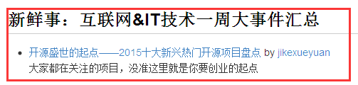

# 极客周刊

极客周刊（β）

极客学院2016第一弹，

我们从互联网的犄角旮旯收罗最有价值的内容汇成此刊，希望能成为你每周必读的一份期待。

简要说明：

- 频次：周刊
- 时间：每周五（上午）发出
- 栏目设置：#新鲜事 #干货集 #大集市 #爱分享 #自留地 等等好玩有趣有料~
- 谁在操刀：一群爱分享的技术宅们

输入你常用的邮箱订阅（注意：订阅后需要去邮箱里点击确认），成功后会收到一封有`福利`的欢迎信，等你来~

订阅地址：<http://list.qq.com/cgi-bin/qf_invite?id=83392b8505dd16951d180f02fe45e724a4f0c455983ca581>

>周刊QQ群：241417150
>
>周刊编辑群：432169252

## 周刊微信号

**扫描二维码即可加入，定时推送周刊和优质技术文章**

## 欢迎投稿

期刊列表里面会实时更新期刊情况，欢迎广大爱分享的极客们投稿。

### 1.GitHub用户投稿：

1. 提交 [issues](https://github.com/jikexueyuanwiki/geek-weekly-newsletter/issues/new)，issues 标题为 **投稿第XX期**，内容按 **标题+链接** 形式（能加上推荐理由是件非常Nice的事）。
2. 根据内容选择 Labels 分类。分类简介：
   - 新鲜事——业内（互联网IT技术）一周大事件汇总
   - 干货集：IT技术干货汇聚（类似开发者头条，不要求时间上最新，力求实用） 
   - 大集市：乱七八糟的一些有价值的东西
   - 爱分享：用户原创或者分享的有价值内容，包括视频、博客、教程等 
   - 自留地：极客学院相关课程（包括视频、Wiki、问答、Download等）、产品更新及相关活动的推荐
3. Submit，等待主编确认

参考例子请看这里：<https://github.com/jikexueyuanwiki/geek-weekly-newsletter/issues>

### 2.非GitHub用户投稿

投稿请点击： [http://form.mikecrm.com/f.php?t=iB0rVf](http://form.mikecrm.com/f.php?t=iB0rVf)   

我们会为审核通过的稿件提供署名发表，感谢参与：）   

### 署名小福利

主编审核通过后，我们会添加投稿人联系方式，展现形式如下：

## 期刊列表

|名称|发布时间|
|------|-----------|
|[极客周刊 第一期](issues-1/newsletter-one.md) |2015年1月3日~8日|
|[极客周刊 第二期](issues-2/newsletter-two.md) |2015年1月10日~15日|
|持续更新ing......||

## 主编及贡献者

- [zhangyushu](https://github.com/zhangyushu)
- [dongxuejian](https://github.com/YDMDFGOFIGHTING)
